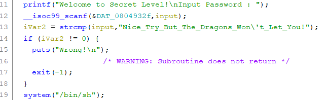
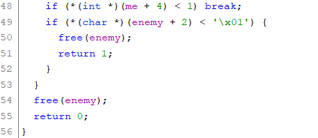
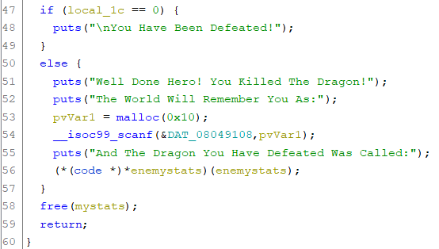
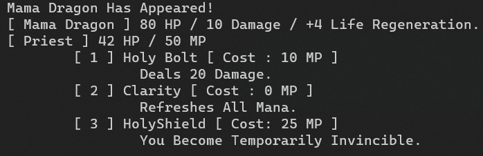
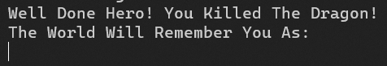

# Dragon writeup

This is the challenge named dragon from [pwnable.kr](http://pwnable.kr/play.php)
Writeup by Amit Shmuel

### Problem

I made a RPG game for my little brother.
But to trick him, I made it impossible to win.
I hope he doesn't get too angry with me :P!

Author : rookiss
Download : http://pwnable.kr/bin/dragon

Running at : nc pwnable.kr 9004

### Solution

After playing around with the binary a bit we can see it's a pretty straight forward battling system with alternating battles against the mama and baby dragons but it seems quite impossible to win against the dragons as the problem description would suggest.

Let's open the binary in Ghidra. Out of the gate we immediately notice a few important functions. In the SecretLevel function we can see this code:



But &DAT_0804932f is %10s so we can't write the whole password into the variable because it's longer than 10 characters. That means we either have to find a way to jump to the system syscall or we need to find a way to get an arbitrary write of 1 byte so we can change %10s to %90s.

The main game function which deals with the game logic is called DragonFight, the function allocates and sets the player stats and the enemy stats and it has 2 functions it uses called PriestAttack and KnightAttack for the battle mechanics. The obvious exploit is in these areas is that in the PriestAttack and KnightAttack functions we free the enemy stats heap chunk as seen here:



And if we win we get to enter our name (to overwrite the previous buffer data) and call a function which was in that chunk:



That means that if we win we can arbitrarily jump to any code and that means we can jump to the system syscall! Hooray! or is it? Because that means we need to win the game which the programmer made impossible (and countless tries from me made sure it is). So how can we win? Well we take advantage of integer overflows! You might have noticed that in the picture where we free the enemy stats we also check it's health and it's health is a signed char, that means that if it's health gets over 127 it flips to negative and that means we win (because it's reeeaaally dead now). 

The dragons have a health regeneration, the baby dragon regenerates +5 HP per round and the mama dragon generates +4 HP per round, but because the baby dragon is more powerful and has less health it will kill us way before we overflow it, so the mama dragon it is. But how can we not die you ask? Well if we look at the Priest abilities we can see it can block attacks at the cost of 25 mana, and if we do Block Block Refresh mana 4 times it turns out to be just enough to overflow and kill the mama dragon:



And as we expected we won after using HolyShield HolyShield Clarity 4 times:



Now we're left with entering the 16 bytes which the first 4 bytes of are the address which we jump to (needs to be set to 0x8048dbf which is the address of the system syscall). Just to make sure which of the bytes control the address I ran the program in gdb and put in AAAABBBBCCCCDDDD and got that it tried to jump to 0x41414141 which means the hypothesis was correct!

Now all that's left is to package it in a neat pwntools script:

```python
from pwn import *

sh = remote("pwnable.kr", 9004)

binsh = p32(0x8048dbf)

sh.sendline("2") # Pick Knight
sh.sendline("2") # Die as knight

sh.sendline("1") # Pick priest

for _ in range(4):
    sh.sendline("3") # Block
    sh.sendline("3") # Block
    sh.sendline("2") # Refresh mana

sh.recvuntil("Well Done Hero! ")
print(sh.recvuntil("As:"))
sh.sendline(binsh)
sh.interactive() # Now send 'cat flag' to get the flag
```

Hope you had fun reading this writeup!